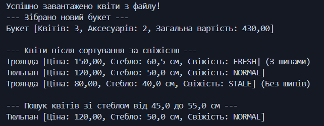
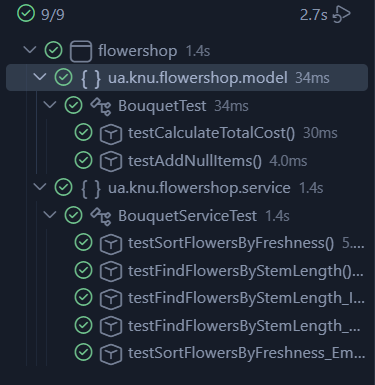

# Лабораторна робота 1: Магазин квітів (Flower Shop) 

Flower Shop - це Java-застосунок для моделювання збірки та обробки квіткових композицій. Проєкт демонструє практичне застосування базових принципів ООП (інкапсуляція, успадкування, поліморфізм), роботу з колекціями та сучасним Stream API.

## Відповідність вимогам лабораторної роботи

1. **Використання можливостей ООП:** 
   * *Інкапсуляція:* поля класів приховані модифікатором `private`, доступ реалізовано через публічні геттери.
   * *Поліморфізм:* метод `calculateTotalCost()` універсально обробляє колекції різних об'єктів (квітів та аксесуарів) через їхні базові абстракції.
2. **Змістовні назви та наповнення:** Усі класи та змінні мають англомовні назви, що повністю відповідають предметній області (`Bouquet`, `Flower`, `Freshness`, `Wrapper`).
3. **Оправдане спадкування:** Створено абстрактні базові класи `Flower` та `Accessory`. Спадкування застосовано логічно (наприклад, `Rose` розширює `Flower` специфічним полем `hasThorns`).
4. **Оформлення коду:** Код написаний з дотриманням стандартів Java Code Convention (правила CamelCase, відступи, структурування).
5. **Розподіл по пакетах:** Проєкт чітко структуровано згідно з архітектурними нормами:
   * `ua.knu.flowershop.model` — доменні моделі даних.
   * `ua.knu.flowershop.service` — бізнес-логіка (сортування, фільтрація).
6. **Мінімальна робота з консоллю:** Логіка повністю відокремлена від взаємодії з користувачем. Клас `Main` слугує виключно для базової демонстрації роботи алгоритмів.
7. **Збереження параметрів ініціалізації з файлів:** Реалізовано сервіс `FileInitializer`, який зчитує початкові параметри квітів із текстового файлу `flowers.txt`.
8. **Тестування:** Ключова бізнес-логіка покрита модульними тестами за допомогою **JUnit 5**. Для ізольованого тестування сервісу (`BouquetServiceTest`) використано **Mockito**. Перевірено як позитивні, так і негативні (Exception) сценарії.
9. **Робота з репозиторієм:** Код розміщено на віддаленому репозиторії. Налаштовано файл `.gitignore` (виключено `.class`, `target/`), історія змін ведеться з використанням логічних повідомлень за стандартом Conventional Commits (`feat:`, `test:`, `chore:`).

## Реалізований функціонал
* **Ієрархія класів:** абстрактні класи для квітів та аксесуарів, конкретні реалізації (Троянда, Тюльпан, Стрічка, Обгортка).
* **Конструктор букета:** збирання елементів у єдину сутність та автоматичний розрахунок загальної вартості.
* **Бізнес-логіка (`BouquetService`):** 
  * Сортування квітів у букеті за рівнем свіжості.
  * Фільтрація та пошук квітів за заданим діапазоном довжини стебла.

## Технологічний стек
* **Java 17**
* **Maven** (система збірки та управління залежностями)
* **JUnit 5 & Mockito** (Unit-тестування та ізоляція через мок-об'єкти)

## Структура
* `src/main/java/ua/knu/flowershop.model` — доменні моделі (квіти, аксесуари, букет).
* `src/main/java/ua/knu/flowershop.service` — сервіси для виконання алгоритмічної логіки.
* `src/test/java/...` — модульні тести, що покривають позитивні та крайові сценарії (з обробкою винятків).

## Опис модульних тестів (Unit Tests)
Проєкт покритий модульними тестами за допомогою **JUnit 5** та ізольованими мок-об'єктами за допомогою **Mockito**. Тести перевіряють як стандартну поведінку (happy path), так і крайові випадки з обробкою винятків:

1. **`BouquetTest`** (`ua.knu.flowershop.model`)
   * `testCalculateTotalCost()` — перевіряє правильність загального розрахунку вартості букета (сума всіх квітів та аксесуарів).
   * `testAddNullItems()` — перевіряє поведінку букета при спробі додати нульові (null) елементи (захист від невалідних даних).

2. **`BouquetServiceTest`** (`ua.knu.flowershop.service`)
   * `testSortFlowersByFreshness()` — перевіряє коректність сортування списку квітів за рівнем їх свіжості.
   * `testFindFlowersByStemLength()` — перевіряє фільтрацію квітів у букеті за заданим діапазоном мінімальної та максимальної довжини стебла.
   * `testFindFlowersByStemLength_InvalidRangeThrowsException()` — негативний тест: перевіряє викидання винятку `IllegalArgumentException`, якщо мінімальна довжина перевищує максимальну.
   * `testFindFlowersByStemLength_NegativeLengthThrowsException()` — негативний тест: перевіряє реакцію сервісу на введення від'ємних значень довжини стебла.
   * `testSortFlowersByFreshness_EmptyBouquet()` — перевіряє обробку порожнього букета (сервіс не падає, а безпечно повертає порожній список).

## Результати виконання

### Демонстрація роботи програми

### Результати Unit-тестування
